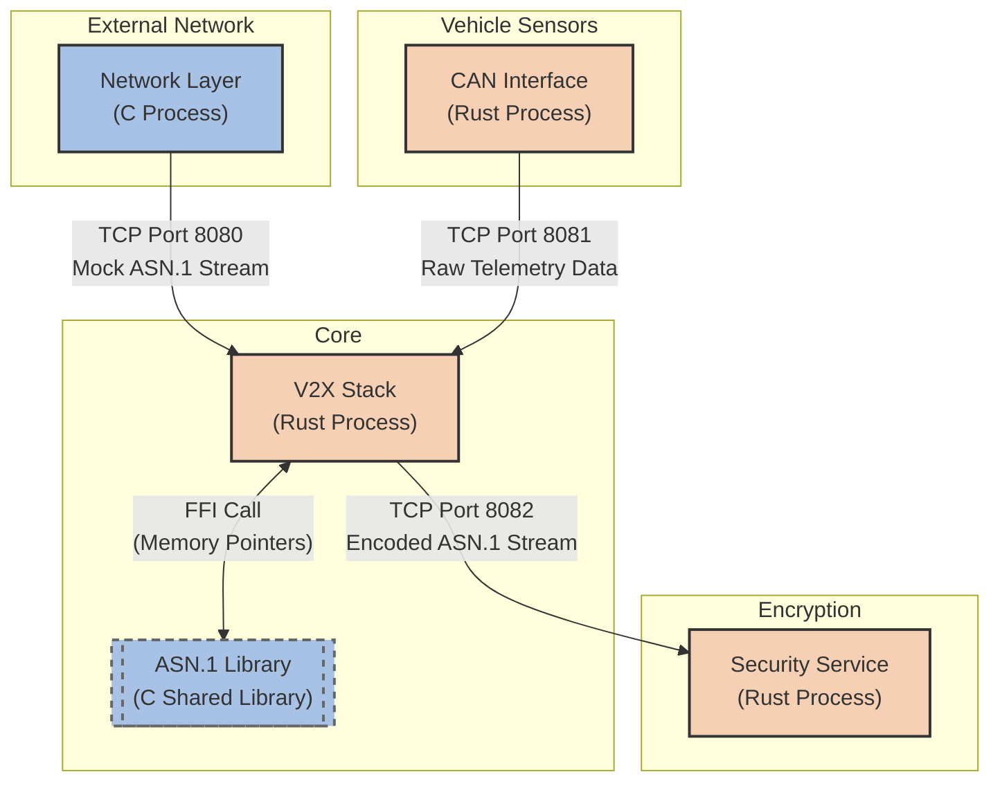

# V2X Architecture Integration Demo

## Purpose
This project serves as a mock demonstration of how to integrate a legacy **C Library** into a modern **Rust**-based system architecture. Specifically, it simulates a **V2X (Vehicle-to-Everything)** stack where a central Rust process acts as the coordinator, taking in network frames and vehicle CAN data via TCP, while leveraging a C shared library (`libasn1.so`) via Foreign Function Interface (FFI) for specialized ASN.1 encoding and decoding algorithms. 

The goal is to demonstrate:
1. Multi-process Inter-Process Communication (IPC) via TCP.
2. Linking C shared libraries to Rust applications dynamically.
3. Calling C functions and passing structs/pointers natively from Rust using `bindgen` / `extern "C"`.

---

## High Level Architecture

The architecture is split into 4 distinct active processes and 1 shared C library.



### Component Details
*   **ASN.1 Library (C Shared Library):** A library exposing `asn1_encode` and `asn1_decode` to serialize/deserialize the `BSMData` (Basic Safety Message) C-struct.
*   **V2X Stack (Rust Main Module):** The core process. It utilizes the ASN.1 library to decode external TCP payloads from the network layer, and encode internal vehicle TCP payloads from the CAN interface before forwarding them to the security service.
*   **Network Layer (C Process):** A mock C program simulating DSRC/C-V2X radios. It sends a continuous stream of BSM data over TCP.
*   **CAN Interface (Rust Process):** A mock Rust program simulating the vehicle's internal sensors. It sends speed/heading data over TCP.
*   **Security Service (Rust Process):** A mock Rust program that accepts fully encoded payloads and acts as if it is signing/encrypting them for broadcast.

---

## How to Build and Start

Because this is a multi-process architecture, the easiest way to launch the system is to use the provided `start.sh` script, which compiles the C libraries, builds the Rust crates, and launches the processes in the correct order.

### Method 1: The Automated Launcher (Recommended)

1. Open a terminal in the `V2X_Project` directory.
2. Make sure the script is executable:
   ```bash
   chmod +x start.sh
   ```
3. Run the script:
   ```bash
   ./start.sh
   ```
4. *Press `Ctrl+C` to gracefully terminate all 4 background processes at once.*

### Method 2: Manual Startup

If you want to run the modules manually (e.g., in separate terminal tabs to see isolated logs), you must follow this exact order:

**1. Build everything:**
```bash
# Build C Library
cd asn1_lib && make && cd ..

# Build C Network Layer
cd network_layer && make && cd ..

# Build Rust Crates
cd security_service && cargo build && cd ..
cd can_interface && cargo build && cd ..
cd v2x_stack && cargo build && cd ..
```

**2. Start the Security Service:**
```bash
cd security_service
cargo run
```

**3. Start the Main V2X Stack:**
*Note: The V2X Stack needs to know where `libasn1.so` is located, so you MUST export `LD_LIBRARY_PATH` before running it.*
```bash
cd v2x_stack
export LD_LIBRARY_PATH="../asn1_lib:$LD_LIBRARY_PATH"
cargo run
```

**4. Start the Data Sources (In any order):**
```bash
# In a new terminal
cd can_interface
cargo run

# In another new terminal
cd network_layer
./network_dummy
```
